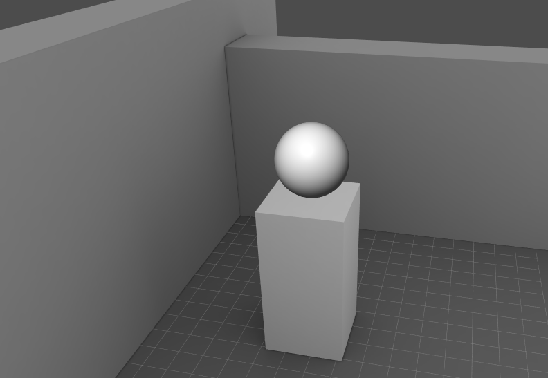

# Zogra Render Engine

A simple WebGL2 renderer.

## Build Requirement
- Node @latest
- Typescript @4.1.5+

## Tested Platforms
- Chrome 79+ (Desktop)
- FireFox 72+ (Desktop)
- Chrome 79+ (Android)
- ...

## Screen Shots

## Features
- Basic 3D mesh rendering.
- Line rendering.
- Shader & material managment.
- Image texture & render texture.
- Basic scene manager.
- Input system.
- Simple phyiscally-based shading.
- FBX import.
- ...

## Demo
- [Snake Game](https://sardinefish.github.io/snake-remake/) A simple 2D game demo. Eat more foods before running out of lights :)
- [Game of Life](https://sardinefish.github.io/zogra-renderer/life-game.html?fps=30) Large scale game of life powered by WebGL
- [XPBD soft-body sphere](https://sardinefish.github.io/zogra-renderer/constraint.html)
- [Particle system and bloom](https://sardinefish.github.io/zogra-renderer/post-process.html)
- [Editor](https://sardinefish.github.io/zogra-renderer/editor/) [WIP] A simple web-based scene editor