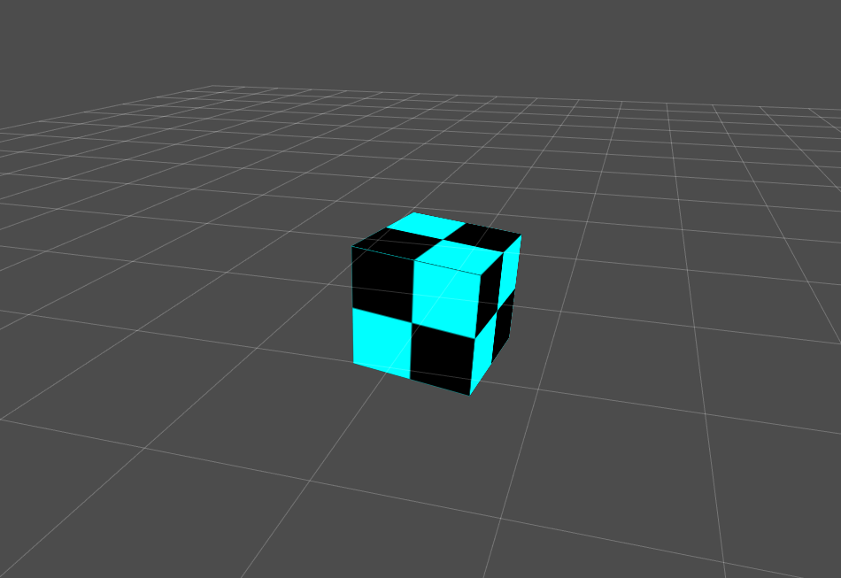

# Zogra Render Engine

A simple WebGL2 renderer.

## Build Requirement
- Node @latest
- Typescript @3.7+

## Supported Platforms
- Chrome 79 (Desktop)
- FireFox 72 (Desktop)
- Chrome 79 (Android)
- ...

## Screen Shots

## Features
- Basic 3D mesh rendering.
- Line rendering.
- Shader & material managment.
- Image texture & render texture.
- Basic scene manager.
- Input system.

## Demo
- [Basic 3D Rendering](https://sardinefish.github.io/zogra-renderer/examples/engine-test.html)
- [Game of Life](https://sardinefish.github.io/zogra-renderer/examples/life-game.html?fps=30)